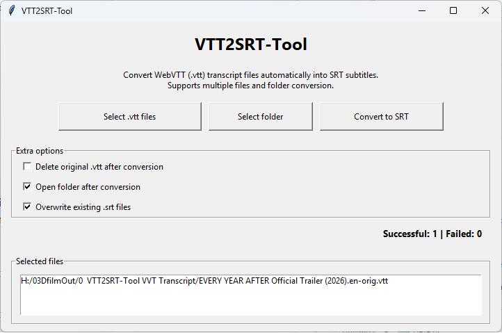

# VTT2SRT-Tool

VTT2SRT-Tool is a simple Windows GUI application that converts WebVTT (.vtt) transcript files into SRT subtitle files. Supports batch conversion, folder processing, optional ffmpeg integration, and an easy-to-use interface.

## Functies:

Convert .vtt subtitles to .srt
Batch subtitle conversion
TXT transcript export
Subtitle translation
Multiple language support
Folder processing
Optional ffmpeg support
Simple GUI interface
Windows friendly

## Screenshot

Supported Translation Languages:
English
Dutch
German
French
Spanish
Japanese

Requirements
Python 3.11+
ffmpeg (optional but recommended)

Install dependencies:

pip install -r requirements.txt

Install ffmpeg (Optional)

Download ffmpeg here:

https://ffmpeg.org/download.html

Recommended Windows builds:

https://www.gyan.dev/ffmpeg/builds/

Add ffmpeg to your Windows PATH for full functionality.

requirements.txt
ffmpeg-python
deep-translator

## Installatie

### Python installeren

Download Python:
https://www.python.org/downloads/

Run
python VTT2SRT-Tool.py

Future Features
Whisper AI support
AI transcript cleanup
Batch subtitle sync
MKV subtitle embedding
Subtitle timing adjustment
Multi-language AI translation
License

MIT License

GitHub

Created by UtCollector
